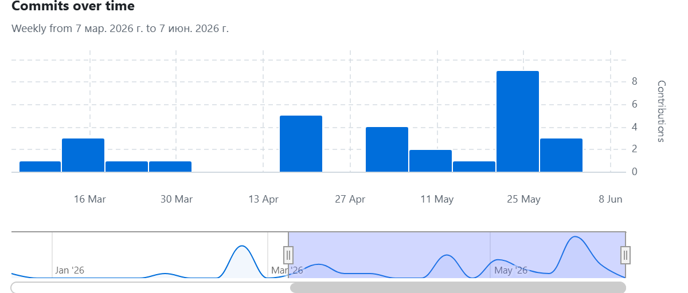
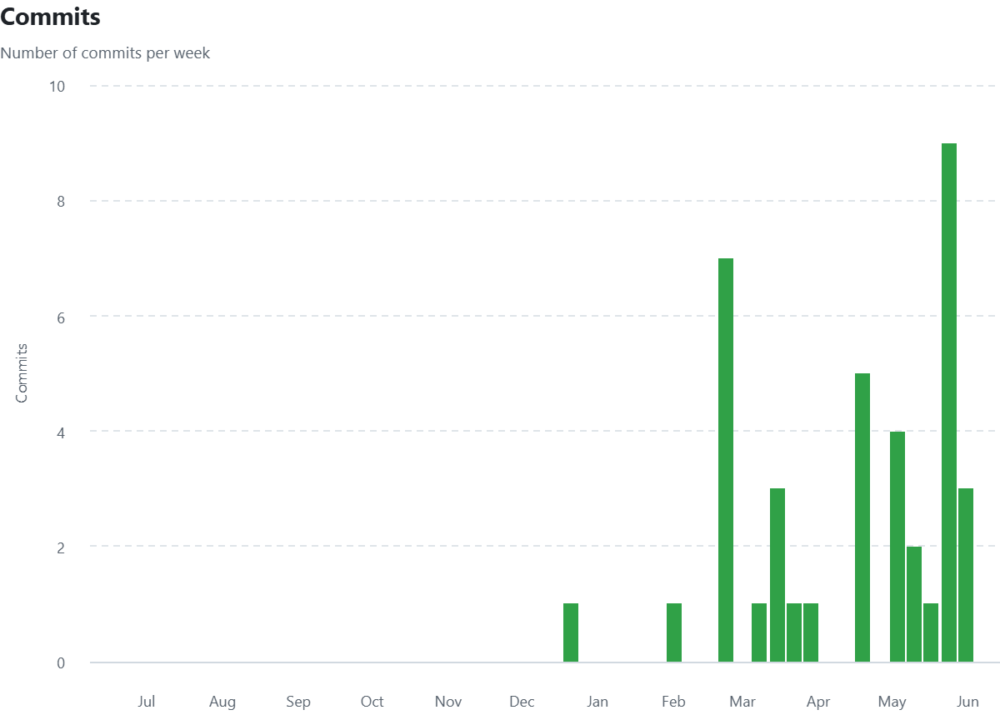

# Тонна — бэкенд

Django REST API + WebSocket для B2B-платформы торговли сельхозпродукцией.

## Стек технологий

| Технология | Версия |
|---|---|
| Python | 3.13.3 |
| Django | 6.0 |
| Django REST Framework | 3.16.1 |
| djangorestframework-simplejwt | 5.5.1 |
| Django Channels (WebSocket) | 4.3.2 |
| Daphne (ASGI-сервер) | 4.2.1 |
| django-cors-headers | 4.9.0 |
| drf-spectacular (OpenAPI/Swagger) | 0.27.2 |
| PostgreSQL | — |

## Структура проекта

```
.
├── apps/
│   ├── bids/           # Заявки на покупку/продажу
│   ├── contacts/       # Контактные запросы
│   ├── notifications/  # Уведомления (REST + WebSocket)
│   └── users/          # Авторизация (OTP), профиль, реквизиты
├── config/
│   ├── settings/
│   │   ├── base.py
│   │   ├── local.py
│   │   └── prod.py
│   ├── asgi.py
│   ├── exception_handler.py
│   ├── urls.py
│   └── wsgi.py
├── docs/
│   └── images/
├── .env.example
├── manage.py
├── openapi.yaml
└── requirements.txt
```

## Запуск локально

1. Клонировать репозиторий:
   ```bash
   git clone <url>
   cd Fermer-back
   ```

2. Создать и активировать виртуальное окружение:
   ```bash
   python -m venv venv
   # Windows
   venv\Scripts\activate
   # macOS / Linux
   source venv/bin/activate
   ```

3. Установить зависимости:
   ```bash
   pip install -r requirements.txt
   ```

4. Скопировать `.env.example` → `.env` и заполнить значения:
   ```bash
   cp .env.example .env
   ```

5. Применить миграции:
   ```bash
   python manage.py migrate
   ```

6. Запустить сервер:
   ```bash
   python manage.py runserver
   ```

Сервер поднимается через **Daphne** (ASGI) — WebSocket поддерживается из коробки по адресу `ws://127.0.0.1:8000/ws/notifications/?token=<access_token>`.

## Переменные окружения

Скопируй `.env.example` в `.env` и задай значения:

| Переменная | Описание |
|---|---|
| `SECRET_KEY` | Секретный ключ Django. Обязателен в продакшене. |
| `DB_NAME` | Имя базы данных PostgreSQL. |
| `DB_USER` | Пользователь PostgreSQL. |
| `DB_PASSWORD` | Пароль пользователя PostgreSQL. |
| `DB_HOST` | Хост PostgreSQL (например, `localhost`). |
| `DB_PORT` | Порт PostgreSQL (например, `5432`). |
| `REDIS_HOST` | Хост Redis, используется для Django Channels. |
| `REDIS_PORT` | Порт Redis (по умолчанию `6379`). |

## API-документация

После запуска сервера:

- **Swagger UI:** `http://127.0.0.1:8000/api/schema/swagger-ui/`
- **OpenAPI-схема (YAML):** `http://127.0.0.1:8000/api/schema/`

## Статистика разработки

### Метрики Git
- Всего коммитов: 78
- Период: 21.12.2025 — 08.06.2026
- Средняя частота: 3.07 коммита/неделю

### График активности


### Тепловая карта

