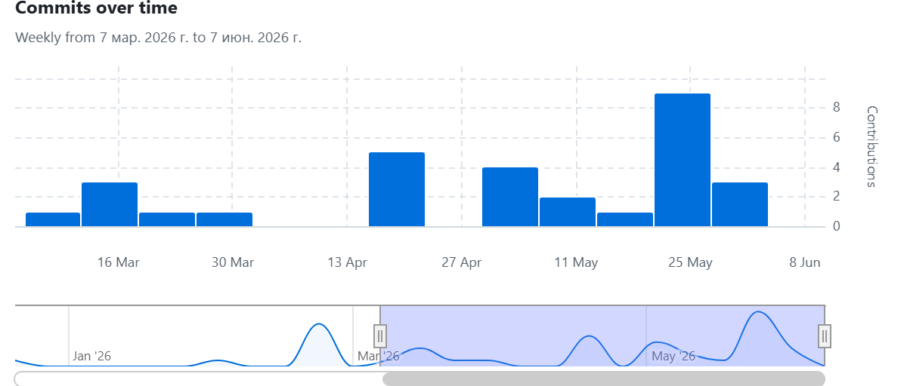
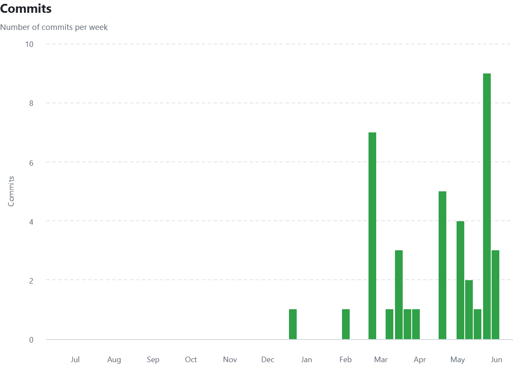

# Тонна — бэкенд

«Тонна» — это B2B-маркетплейс сельхозпродукции, где фермеры и закупщики публикуют заявки на покупку и продажу и устанавливают первичный контакт друг с другом; платформа закрыта для гостей, а все участники верифицируются по номеру телефона. Бэкенд на Django REST Framework и Django Channels реализует вход по OTP-коду с выдачей JWT-токенов, CRUD заявок с фильтрацией, поиском, пагинацией и архивацией, контактные запросы со «снимком» данных отправителя, а также профили с реквизитами организаций. Уведомления о входящих запросах сохраняются в базе и доставляются получателю в реальном времени по WebSocket-каналу с аутентификацией по JWT

## Стек технологий

| Технология | Версия |
|---|---|
| Python | 3.13.3 |
| Django | 6.0 |
| Django REST Framework | 3.16.1 |
| djangorestframework-simplejwt | 5.5.1 |
| Django Channels (WebSocket) | 4.3.2 |
| Daphne (ASGI-сервер) | 4.2.1 |
| django-cors-headers | 4.9.0 |
| drf-spectacular (OpenAPI/Swagger) | 0.27.2 |
| PostgreSQL | 17 |
| Redis | 8.0.0 только для продакшена: channels_redis 4.2.1 |

## Структура проекта

```
.
├── apps/
│   ├── bids/           # Заявки на покупку/продажу
│   ├── contacts/       # Контактные запросы
│   ├── notifications/  # Уведомления (REST + WebSocket)
│   └── users/          # Авторизация (OTP), профиль, реквизиты
├── config/
│   ├── settings/
│   │   ├── base.py
│   │   ├── local.py
│   │   └── prod.py
│   ├── asgi.py
│   ├── exception_handler.py
│   ├── urls.py
│   └── wsgi.py
├── docs/
│   └── images/
├── .env.example
├── manage.py
├── openapi.yaml
└── requirements.txt
```

## Запуск локально

1. Клонировать репозиторий:
   ```bash
   git clone https://github.com/Andrey-Strekalov/Fermer-back.git
   cd Fermer-back
   ```

2. Создать и активировать виртуальное окружение:
   ```bash
   python -m venv venv
   # Windows
   venv\Scripts\activate
   # macOS / Linux
   source venv/bin/activate
   ```

3. Установить зависимости:
   ```bash
   pip install -r requirements.txt
   ```
4. Создать базу данных PostgreSQL (имя, пользователя и пароль потом укажем в `.env`):
```bash
   psql -U postgres
   CREATE DATABASE ⟨имя_базы⟩;
```

5. Запустить Redis (нужен для WebSocket-уведомлений):

> Локально Redis не нужен: в `config/settings/local.py` используется `InMemoryChannelLayer`.
> Redis требуется только в продакшене (`config/settings/prod.py`) для работы WebSocket-уведомлений
> с несколькими процессами.

6. Скопировать `.env.example` → `.env` и заполнить значения:
   ```bash
   cp .env.example .env
   ```

7. Применить миграции:
   ```bash
   python manage.py migrate
   ```

8. Запустить сервер:
   ```bash
   python manage.py runserver
   ```
Локально используются настройки `config/settings/local.py`. `prod.py` предназначен для продакшена, переключение в `manage.py` .
Сервер поднимается через **Daphne** (ASGI) — WebSocket поддерживается из коробки по адресу `ws://127.0.0.1:8000/ws/notifications/?token=<access_token>`.

## Переменные окружения

Скопируй `.env.example` в `.env` и задай значения:

| Переменная | Описание |
|---|---|
| `SECRET_KEY` | Секретный ключ Django. Обязателен в продакшене. |
| `DB_NAME` | Имя базы данных PostgreSQL. |
| `DB_USER` | Пользователь PostgreSQL. |
| `DB_PASSWORD` | Пароль пользователя PostgreSQL. |
| `DB_HOST` | Хост PostgreSQL (например, `localhost`). |
| `DB_PORT` | Порт PostgreSQL (например, `5432`). |
| `REDIS_HOST` | Хост Redis, используется для Django Channels. только prod|
| `REDIS_PORT` | Порт Redis (по умолчанию `6379`). только prod|

## Вход (OTP)

1. `POST /api/v1/auth/request-code/` с телефоном → сервер создаёт одноразовый код.
2. Локально код виден в окне регистрации. SMS не отправляется.
3. `POST /api/v1/auth/confirm-code/` с телефоном и кодом → в ответе access и refresh токены.

## API-документация

После запуска сервера:

- **Swagger UI:** `http://127.0.0.1:8000/api/schema/swagger-ui/`
- **OpenAPI-схема (YAML):** `http://127.0.0.1:8000/api/schema/`

## Статистика разработки

### Метрики Git
- Всего коммитов: 78
- Период: 21.12.2025 — 08.06.2026
- Средняя частота: 3.07 коммита/неделю

### График активности


### Тепловая карта

